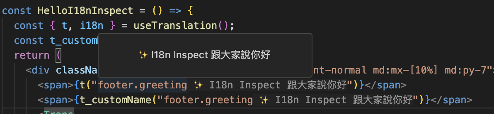
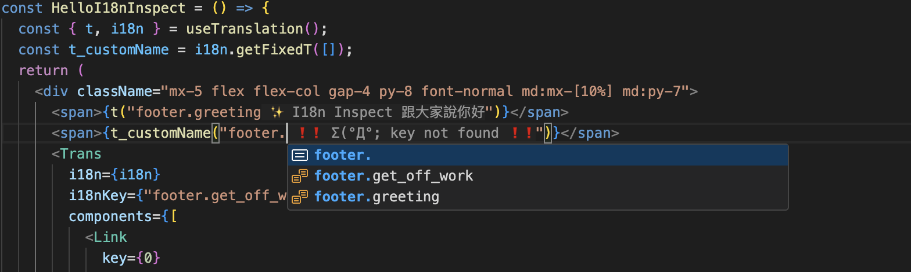
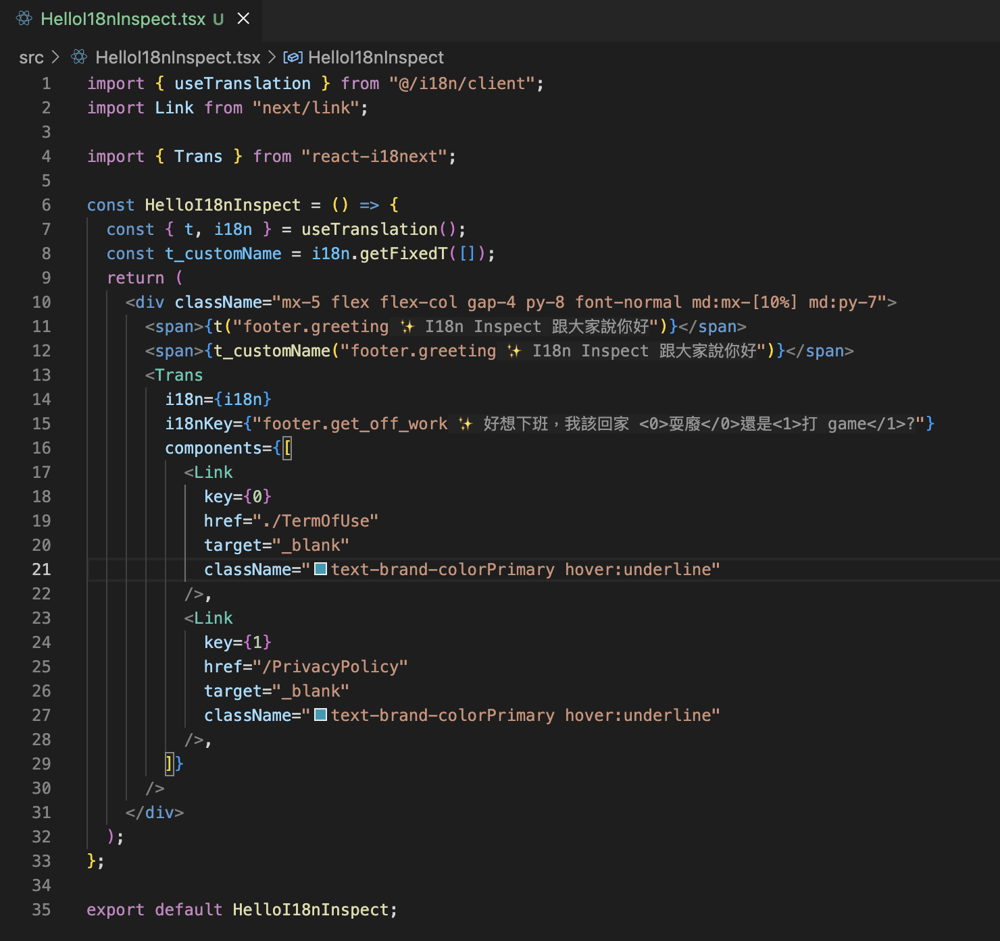

# i18n Inspect

i18n Inspect is a VS Code extension that helps you inspect and manage i18n translation keys in your JavaScript and TypeScript projects. It provides:

1. **Hover Information**: Hover over translation keys (e.g., `t('some.key')`) to see the corresponding translated text.
2. **Auto-Completion**: Get suggestions for valid translation keys as you type.
3. **Configuration Support**: Easily specify and update the path or URL to your translation resource file.
4. **Multiple Detection Patterns**: Supports detecting translation keys used in:
   - `t()`
   - Any `t_customName()` function (custom function names that start with `t_`)
   - The `i18nKey` prop in `<Trans />` components
## Features

- **Hover Provider**: Displays the translation text right in the editor when hovering over a recognized translation key.


- **Completion Provider**: Suggests valid translation keys (auto-complete) based on your resource file.


- **Inlay Hints**: Provides inline hints with translations.


- **Refresh Command**: Refresh translations manually at any time with the `i18nInspect.refresh` command.

## Installation

1. Open the Extensions View in VS Code (`Ctrl + Shift + X` on Windows/Linux, `Cmd + Shift + X` on macOS).
2. Search for `i18n Inspect` and click **Install**.
3. Reload VS Code to activate the extension.

## Usage

1. **Load Translations**  
   - The extension automatically loads the translation file(s) from the path specified by the `i18nInspect.translationResource` setting. By default, it looks for `./translations/zh.json`.

2. **Hover Tips**  
   - Hover your mouse over a translation key in your code to see its corresponding translation.

3. **Auto-Complete**  
   - Start typing a translation key (e.g., `t('...')`) to receive auto-completion suggestions.  
   - Once selected, the completion item replaces just the key portion in your code.

4. **Refresh Translations**  
   - If you update your translations file or change its location, run `i18nInspect.refresh` from the VS Code Command Palette to reload and sync the latest translations.

## Configuration

To configure the extension, open your VS Code settings (`File > Preferences > Settings`) and search for `i18nInspect`. The primary configuration option is:

- **i18nInspect.translationResource** (default: `./translations/zh.json`)  
  Path or URL to your translation resource file. For example:

```json
{
  "i18nInspect.translationResource": "./path/to/myTranslations.json"
}
```

Any time you change this setting, the extension will automatically attempt to reload translations. You can also run the `i18nInspect.refresh` command manually to force a refresh.

## Commands

- **`i18nInspect.refresh`**  
  Manually refreshes translations from the specified `i18nInspect.translationResource`.

Use the command palette (`Ctrl + Shift + P` or `Cmd + Shift + P`) to search and execute this command.

## Contributing

If you encounter bugs, have questions, or want to suggest enhancements:

1. File an issue with steps to reproduce the problem or details about what you would like to see improved.
2. Feel free to submit pull requests with improvements or new features.

## License

This project is licensed under the MIT License. See the [LICENSE](LICENSE) file for details.
